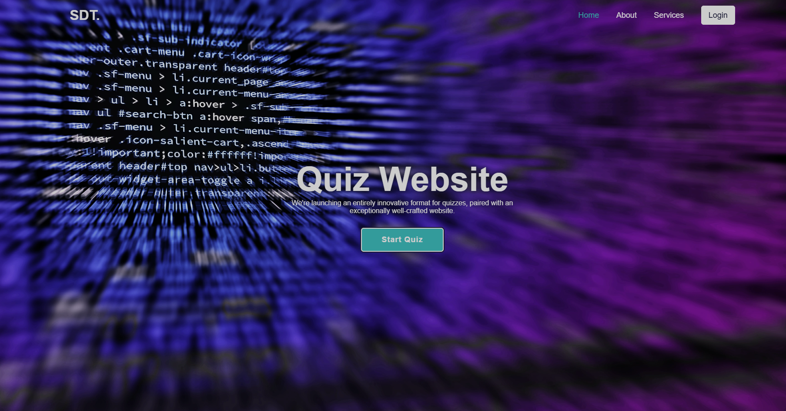
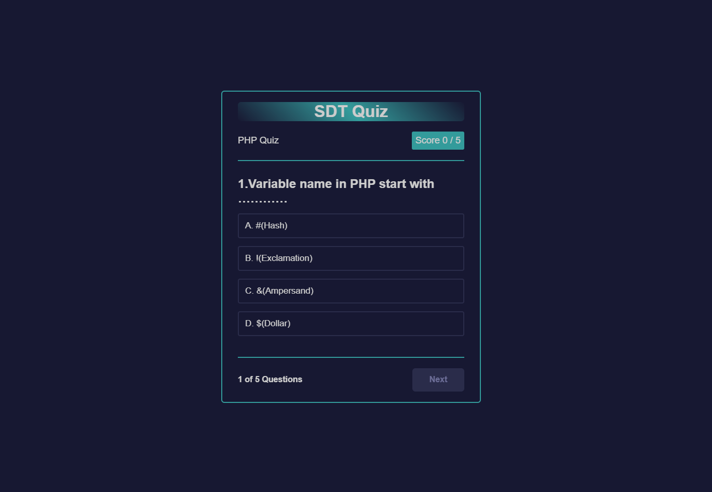

# Simple Quiz Website

This is a fun and interactive quiz website built using **HTML, CSS, and JavaScript**. It allows users to test their knowledge with multiple-choice questions and provides instant feedback.

## 🚀 Features

- **Fully Responsive Design** – Works on all devices.
- **Multiple-Choice Questions** – Engaging and interactive quizzes.
- **Instant Feedback** – Shows correct and incorrect answers.
- **Score Tracking** – Keeps track of user scores.
- **Smooth Animations** – Enhances user experience.

## 🛠️ Tech Stack

- **HTML** – Structure and content
- **CSS** – Styling and layout
- **JavaScript** – Quiz logic and interactivity

## 📸 Screenshots





## 📂 Project Setup

1. Clone the repository:
   ```bash
   git clone https://github.com/ahmed-lotfi/SDT-Quiz.git
   ```
2. Navigate to the project directory:
   ```bash
   cd sSDT-Quiz
   ```
3. Open the `index.html` file in your browser.

## 📬 Contact

For any inquiries or improvements, feel free to reach out at **ahmedmlotfi@outlook.com**.

---

Made with ❤️ by **Ahmed Lotfi**
